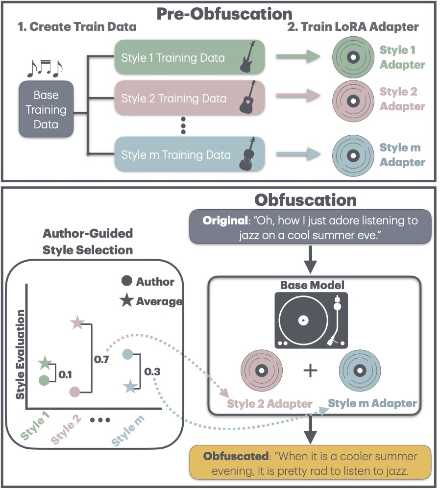

# STYLEREMIX: Authorship Obfuscation Method 
This repository contains the code and the scripts to reproduce the experiments from the paper
[STYLEREMIX: Interpretable Authorship Obfuscation via Distillation and Perturbation of Style Elements](). 

**STYLEREMIX**, is an adaptive and interpretable obfuscation method that perturbs specific, fine-grained style elements of the original input text. STYLEREMIX uses pre-trained Low Rank Adaptation (LoRA) modules to rewrite inputs along various stylistic axes (e.g., formality, length) while maintaining low computational costs. 

<p align="center">

</p>

In this paper we demonstrate the effectiveness of STYlEREMIX on four obfuscation datasets comprised of presidential speeches (SPEECHES), fiction writing (NOVELS), academic articles (SCHOLAR) and diary-style writings (BLOG). When applied in combination with a LLAMA-3 7B model, STYLEREMIX outperforms state-of-the-art authorship baselines and much larger LLMs on an array of domains on both automatic and human evaluation.

In this repo, we provide code which implements STYLEREMIX on a LLAMA-3 8B model for these four datasets.

## Dependencies
The code is written in Python and the dependencies are:
- Python >= 3.10.13
- PyTorch >= 2.1.2
- Huggingface Transformers >= 4.41.1

**Conda Environment**:
We recommend using a [conda environment](https://docs.conda.io/en/latest/miniconda.html)
for Python 3.10.
To setup the environment, run
```bash
conda env create --file environment.yml
# activate the environment
conda activate jambalaya_decoding
```
**Install Dependencies via Pip**:
To install dependencies, run
```bash
pip install -r requirement.txt
```
## Datasets
We use the StyleMix data which is composed offour different domains, presidential speeches (curated in this paper), fictional novels (curated in this paper), the Extended-Brennan-Greenstadt (Brennan et al., 2012) (amt) and the  Blog Authorship corpus (Schler et al., 2006) (blog), using a range of different authors (3 - 5). All raw datasets can be found under the  `test_data/` folder. Note the file `test_data/StyleMix` is a torch file with a dictionary containing a key for each domain (Speeches, Novels, AMT, Blog) and the file `test_data/StyleMix_average_by_author` contains a pre-computed matrix of average automatic evalution by author which is used to choose the weights of the adapters. 

The test dataset can also be downloaded directly from huggingface: [jrfish/AuthorMix](https://huggingface.co/datasets/jrfish/AuthorMix)

```bash
from datasets import load_dataset
data = load_dataset("jrfish/AuthorMix")
```


## Experimental Pipeline
Experimental code for both all domains can be found in the main folder labeled as `obfuscate.py`. Each experiment consists of the following four steps:

1. Download Raw Data:  automatic
2. Run Automatic Evaluation: automatic if using current domains
3. Choosing Styles to Perturb for Adapters: less than 1 minute
4. Choose Weight of Adapters: varies by StyleMix method used (lorahub ~10min, sequential <1min)
5. Obfuscation: varies by StyleMix method used (lorahub ~5min, sequential 5min/style)
6. Evaluation: ~10min


## Citation
If you find this repository useful, or you use it in your research, please cite:
```

```
    
## Acknowledgements

