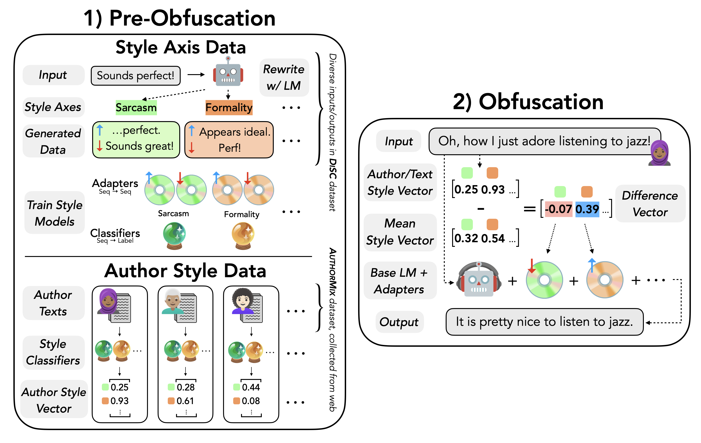

# StyleRemix: Intepretable Authorship Obfuscation
This repository contains the code and the scripts to reproduce the experiments from the paper
[StyleRemix: Interpretable Authorship Obfuscation via Distillation and Perturbation of Style Elements](http://www.arxiv.org/abs/2408.15666). 

**StyleRemix**, is an adaptive and interpretable obfuscation method that perturbs specific, fine-grained style elements of the original input text. StyleRemix uses pre-trained Low Rank Adaptation (LoRA) modules to rewrite inputs along various stylistic axes (e.g., formality, length) while maintaining low computational costs. 

<p align="center">

</p>

We use StyleRemix for obfuscation on four datasets: presidential speeches, fiction writing, academic articles, and diary-style writings. StyleRemix outperforms state-of-the-art authorship baselines and much larger LLMs on an array of domains on both automatic and human evaluation.

In this repo, we provide code which implements StyleRemix on a Llama-3 8B model for these four datasets.

## QuickStart

### Setting up the Environment
To set up the environment to run the code, make sure to have conda installed, then run

    conda create --name obf python=3.10

Then, activate the environment

    conda activate obf

Finally, install the required packages (make sure you are in the root directory).

    pip install -r requirements.txt

### Running StyleRemix on Texts

We include the python file `quickstart.py` which shows how to run StyleRemix on some sample texts. This uses LLama-3 8B as the base model, so you must do inference with a GPU. Style element weights can either be randomly set or randomly initialized; see the argparser for the full options. Finally, feel free to replace the sample texts with your own data.

You can either import the `remix(...)` method into your own code, or you can run this file directly, for example: 

```
# Example commands to run StyleRemix on text:

# Passing in manually weights for different style elements (higher=more, lower=less, -1 to 1)
python3 quickstart.py --length 0.7 --sarcasm 0.9

# Randomly set weights for different style elements
python3 quickstart.py --random_weights --num_random 3
```

## Resources

All resources (trained models, demo, etc.) have been organized into the following [huggingface collection](https://huggingface.co/collections/hallisky/authorship-obfuscation-66564c1c1d59bb62eaaf954f). 
    
## Datasets
We use the AuthorMix data which is composed offour different domains, presidential speeches (curated in this paper), fictional novels (curated in this paper), the Extended-Brennan-Greenstadt (Brennan et al., 2012) (amt) and the  Blog Authorship corpus (Schler et al., 2006) (blog), using a range of different authors (3 - 5). All raw datasets can be found under the  `test_data/` folder. Note the file `test_data/AuthorMix` is a torch file with a dictionary containing a key for each domain (Speeches, Novels, AMT, Blog) and the file `test_data/AuthorMix_average_by_author` contains a pre-computed matrix of average automatic evalution by author which is used to choose the weights of the adapters. 

The test dataset can also be downloaded directly from huggingface: [link](https://huggingface.co/datasets/hallisky/AuthorMix)

```
from datasets import load_dataset
data = load_dataset("hallisky/AuthorMix")
```


## More Detailed Code: Experimental Pipeline
Experimental code for both all domains can be found in the main folder labeled as `obfuscate.py`. Each experiment consists of the following four steps:

1. Download Raw Data:  automatic
2. Run Automatic Evaluation: automatic if using current domains
3. Choosing Styles to Perturb for Adapters: less than 1 minute
4. Choose Weight of Adapters: varies by AuthorMix method used (lorahub ~10min, sequential <1min)
5. Obfuscation: varies by AuthorMix method used (lorahub ~5min, sequential 5min/style)
6. Evaluation: ~10min


## Citation
If you find this repository useful, or you use it in your research, please cite:
```
@misc{fisher2024styleremixinterpretableauthorshipobfuscation,
      title={StyleRemix: Interpretable Authorship Obfuscation via Distillation and Perturbation of Style Elements}, 
      author={Jillian Fisher and Skyler Hallinan and Ximing Lu and Mitchell Gordon and Zaid Harchaoui and Yejin Choi},
      year={2024},
      eprint={2408.15666},
      archivePrefix={arXiv},
      primaryClass={cs.CL},
      url={https://arxiv.org/abs/2408.15666}, 
}
```
    
## Acknowledgements

## Contact

If you have any issues with the repository, questions about the paper, or anything else, please email jrfish@uw.edu and hallisky@uw.edu.

